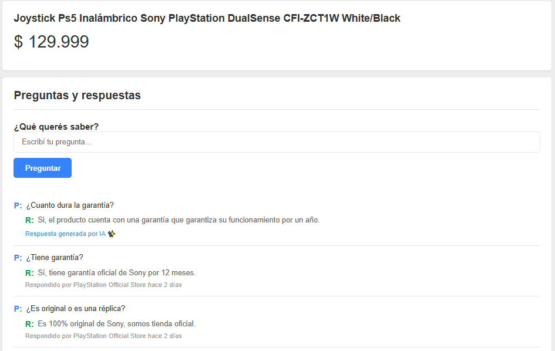

# Generador de respuestas automáticas

Utilizando semantic search, se encuentran las preguntas similares y, cuando el comprador hace una nueva pregunta, un LLM responde de manera autómatica teniendo en cuenta el historial de preguntas y respuestas del producto.

- [X] Generacion de respuestas automáticas

Mejoras:
- [ ] Creación de FAQ automática